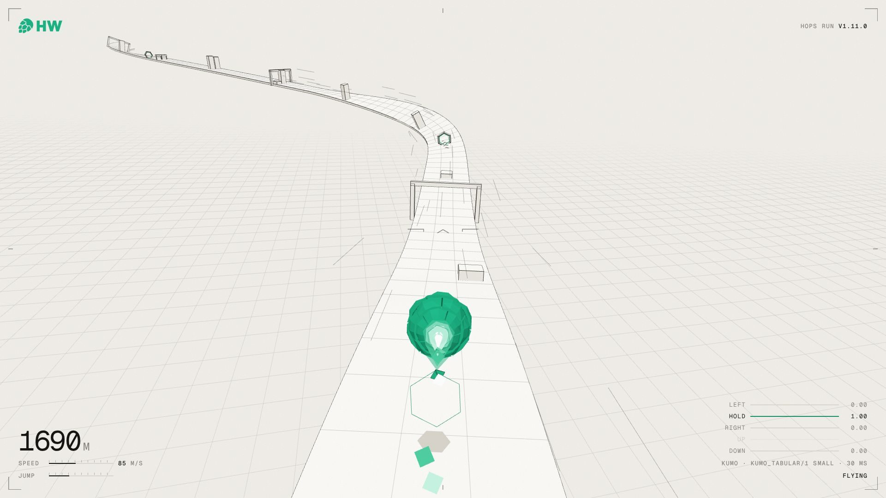
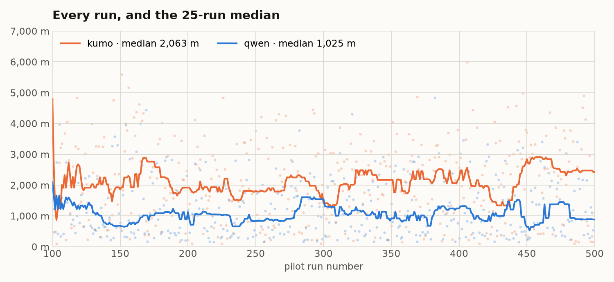
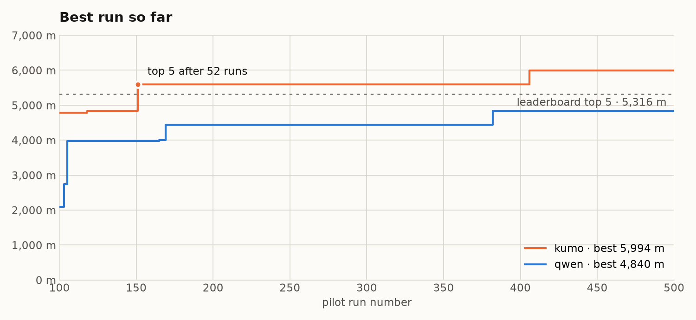

# Hops Run

[Hops Run](https://game.hopsworks.ai), a low-poly racer, and the decision models served on [Hopsworks](https://www.hopsworks.ai) that fly it live. Every move the hops makes is one call to a Hopsworks model deployment: the game sends the situation, the model answers with a probability per move, in about 30 ms.



Play it at [game.hopsworks.ai](https://game.hopsworks.ai). The pilots fly it around the clock on the [live stream](https://www.youtube.com/channel/UCtuK0GKJl8TVLqj2702y_Fg/live), and every run they finish lands on the same leaderboard as yours.

## The models

| Pilot | Model | How it decides | Deployment | Folder |
| --- | --- | --- | --- | --- |
| `qwen` | [Qwen3-4B](https://huggingface.co/Qwen/Qwen3-4B) with [SemIf](https://github.com/TheoLeeCJ/SemIf) | Reads the situation in plain English and scores each move from the model's logits, in one forward pass | `semif4b`, 1 GPU | [`qwen/`](qwen) |
| `kumo` | [NVIDIA Kumo Tabular](https://huggingface.co/nvidia/Kumo-Tabular) | Learns the game from 78 labelled situations given in context, with no training step | `kumo`, 2 CPU cores | [`kumo/`](kumo) |
| `[tbd] clef` | [Cloudflare Clef-Flash](https://huggingface.co/Cloudflare/clef-flash) | Answers the move as a SystemOne choice question with its joint schema head | `clef`, 1 GPU | [`clef/`](clef) |

## Run them on Hopsworks

Each model is three steps: import it from Hugging Face into the model registry, build its Python environment, deploy it. Point the SDK and the [`hops`](https://docs.hopsworks.ai) CLI at your project first:

```bash
export HOPSWORKS_HOST=your-cluster.hopsworks.ai
export HOPSWORKS_API_KEY=...
export HOPSWORKS_PROJECT=jevworks
pip install hopsworks
```

### qwen

```bash
python -c 'import hopsworks; hopsworks.login().get_model_registry().hf_download("Qwen/Qwen3-4B", selected_formats=["safetensors"])'
hops env clone jevworks-inference --from torch-inference-pipeline
hops env install jevworks-inference -f qwen/requirements.txt
python qwen/deploy.py
```

### kumo

```bash
python -c 'import hopsworks; hopsworks.login().get_model_registry().hf_download("nvidia/Kumo-Tabular", selected_filenames=["README.md", "LICENSE", "small/classifier.pt"])'
hops env clone kumo-inference --from torch-inference-pipeline
hops env install kumo-inference -f kumo/requirements.txt
python kumo/deploy.py
```

`--size medium` or `--size large` deploys the bigger Kumo Tabular; import its `classifier.pt` alongside.

### clef

```bash
python -c 'import hopsworks; hopsworks.login().get_model_registry().hf_download("Cloudflare/clef-flash")'
hops env clone clef-inference --from torch-inference-pipeline
hops env install clef-inference -f clef/requirements.txt
python clef/deploy.py
```

Each deployment is then live behind the project's inference endpoint, with its own predict URL, logs and metrics in Hopsworks.

## How a pilot decides

The game hands the runner `{ lane, airborne, ahead }`, where `ahead` lists the rows in front of the hops with their distance and what each lane holds. Each model gets it in its own form.

**qwen** reads a description of the nearest row only:

- `state`: the rules, then the situation. *The hops crashes if it hits a wall: jumping or ducking never clears a wall, only moving to another lane does. Jumping clears a low block or a bar. Ducking clears a bar. Flying straight is only safe in an open lane. The hops is in the centre lane. The next row of obstacles is 60 m ahead.* "in the air" follows the lane when the hops is airborne; with no row ahead, the last sentence is "There are no obstacles ahead."
- `question`: "What should the hops do?"
- `options`, each stating the consequence of the move:
  - `left` / `right`: "Move to the left lane, which has a wall". Offered only where that lane exists.
  - `hold`: "Stay in the centre lane, which has nothing, it is open, and fly straight".
  - `up`: "Stay in the centre lane, which has ..., and jump". Offered only when the hops is on the ground.
  - `down`: "Stay in the centre lane, which has ..., and duck".

```
POST /v1/jevworks/semif4b/v1/models/semif4b:predict
{"inputs": [{"id": "hops", "state": "...", "question": "What should the hops do?",
             "options": [{"id": "left", "description": "..."}, ...]}]}

{"predictions": [{"id": "hops", "option_ids": ["left", "hold", "up", "down"],
                  "probabilities": [0.76, 0.01, 0.0, 0.0], "forward_seconds": 0.03,
                  "model": {"revision": "hopsworks:Qwen3_4B/1", "device": "cuda:0", "dtype": "bfloat16"}, ...}]}
```

**kumo** gets the game state as it is (`{"lane": "centre", "airborne": false, "ahead": [...]}`) and answers in the same shape. Its context is a table of 78 game situations labelled with the move the rules call for; the other 33 are held out, and it gets 31 to 33 of those right without ever seeing them.

The runner flies the highest-probability move. Jumps and ducks are timed to the row; lane changes apply at once.

## Game mechanics

Hops Run is procedural. The track and every row of obstacles are generated as you fly, so no two runs are the same and there is nothing to memorise. Straights, banked turns and hills come first; side banks unlock at 300 m, wall rides at 400 m, corkscrews at 500 m, upside-down sections at 700 m and loops at 900 m.

A row of obstacles fills one or two of the three lanes, never all three. Half the obstacles are walls (only a lane change gets you past), a quarter are low blocks (jump) and a quarter are bars (duck, or jump).

And it only gets harder. The hops starts at 45 m/s and gains 1.6 m/s every second up to 160 m/s; speed gates every 140 to 260 m add a 45 m/s burst on top. Rows start 42 to 74 m apart and close in until 2250 m, where they settle at 23 to 41 m.

A wall is passed by changing lane, or by a charged jump: the jump charge fills while flying and with every row cleared, and a full one clears a wall.

Every row can be passed. Before a row is placed, the game flies a witness through it: hopses searched through the game's own physics, with the moves a model pilot has (a lane change at any time, a jump or duck armed against the next row), each one already past every earlier row. A row no witness gets through is drawn again, and moved further down the track if it keeps failing. A run ends on the pilot, never on the track.

The game runs in fixed steps of 1/120 s and draws each run from a seed, so a seed replays the same track at any frame rate. The simulation is [`game/public/sim.js`](game/public/sim.js), shared by the page, the server and the arena.

## Results

Every run each pilot flew on game v1.11.0, taken in order up to the same count for both (709 each), flown interleaved over the same night.

| Pilot | Median | Mean | 90th percentile | Best | Runs to top 5 |
| --- | --- | --- | --- | --- | --- |
| kumo | 2,188 m | 2,119 m | 3,769 m | 5,994 m | 51 (24 min of flight), 4 runs in total |
| qwen | 1,018 m | 1,318 m | 2,747 m | 6,330 m | 32 (10 min of flight), 1 run in total |

Top 5 means a run at or beyond the board's 5th place, 5,316 m. Both models answer in about 30 ms, so speed does not separate them; kumo picks the right move more often.





Neither model was trained on the game. qwen sees no examples at all; kumo sees 78 labelled ones in its context and is never trained on them.

## Behaviour and luck

Every run is a fresh, random track, and that makes for a lot of noise. Kumo flew 4,792 m on its 100th run and crashed at 473 m on the next one: same model, same weights, different track. A single run says very little; a median over a few hundred says something.

The leaderboard ranks best runs, and a best run is mostly a function of how many tries you get. qwen holds the best run on the board, 6,330 m, flown on its 32nd run; it never got near it again in the other 677. kumo's median is twice qwen's, and it made the top 5 four times. One run at 6,330 m is luck doing its job; four runs past 5,316 m is the model.

Neither model learns between runs.

## Arena

[`arena/arena.js`](arena/arena.js) flies pilots headless on the game's simulation, each over the same seeds, so every pilot meets the same tracks.

```bash
(cd game && npm ci)
node arena/arena.js --pilots claude-bot,claude-fable-bot --runs 30
```

A pilot is a bot from [`bots/`](bots) or a decider (`semif`, `kumo`, `jev`, `clef`, with the settings of [`pilot/`](pilot): `SEMIF_URL`, `KUMO_URL`, `CLEF_URL`, `JEV_URL`, `JEV_MODEL`, `TYPESAFE_API_KEY`, `HOPSWORKS_API_KEY`). It is asked as the page asks it, at most once per 60 Hz frame, and its answer lands once its round trip has passed in run time. The table gives each pilot's median, mean, 90th percentile and best; `--json` gives every run. `--seed` sets the first seed, `--max` caps a run's distance (default 100,000 m).

The two bots over seeds 1 to 30 on game v1.12.0:

| Pilot | Median | Mean | 90th percentile | Best |
| --- | --- | --- | --- | --- |
| claude-fable-bot | 6,292 m | 6,114 m | 10,112 m | 11,720 m |
| claude-bot | 3,543 m | 3,870 m | 7,317 m | 9,317 m |

On the same track, claude-fable-bot flies further on 22 of the 30 seeds. A bot's answer lands after the time it took to compute, so a rerun can differ by a step here and there.

## Reference

### SemIf request

```bash
hops deployment predict semif4b --data '{"inputs": [{
  "id": "ticket-1",
  "state": "Password reset succeeded but every login still returns account locked.",
  "question": "Which team should handle this ticket?",
  "options": [
    {"id": "billing", "description": "Billing and refunds"},
    {"id": "account-access", "description": "Authentication, lockouts and account recovery"}
  ]}]}'
```

Response, one entry per row:

```json
{"predictions": [{
  "id": "ticket-1",
  "option_ids": ["billing", "account-access"],
  "probabilities": [0.03, 0.97],
  "option_logits": [12.1, 15.6],
  "input_tokens": 118,
  "forward_seconds": 0.41,
  "total_seconds": 0.43,
  "prompt_sha256": "...",
  "prompt_version": "direct-options-v1",
  "model": {"source": "...", "revision": "hopsworks:Qwen3_4B/1", "dtype": "bfloat16", "device": "cuda:0"},
  "readout": "native full-vocabulary last-position logits restricted to declared answer slots",
  "probability_status": "conditional option score; uncalibrated as decision confidence"
}]}
```

Rows need `id`, `state` (string, object or array), `question`, and 2 to 16 `options` with unique `id` and a `description`. A row whose prompt exceeds 4096 tokens is rejected, never truncated.

### SemIf predictor settings

| Variable | Default | Meaning |
| --- | --- | --- |
| `SEMIF_DEVICE` | `auto` | `cuda`, `mps`, `cpu`, or `auto` (first available in that order) |
| `SEMIF_DTYPE` | `float32` on CPU, `bfloat16` otherwise | Weight dtype |
| `SEMIF_THREADS` | torch default | Intra-op thread count on CPU |

### SemIf integration test

```bash
pip install -e 'qwen[test]'
pytest qwen
```

## Layout

| Path | Role |
| --- | --- |
| [`game/`](game) | The game: page, server, leaderboard, deploy to `game.hopsworks.ai`. |
| [`pilot/`](pilot) | Runner flying the live page with the models, as a Hopsworks App. |
| [`arena/`](arena) | Pilots flown headless on the game's simulation, over the same seeds. |
| [`qwen/`](qwen) | SemIf predictor, deploy script, environment requirements, integration test. |
| `qwen/semif/` | SemIf engine, vendored from [SemIf](https://github.com/TheoLeeCJ/SemIf) (MIT). |
| [`kumo/`](kumo) | Kumo Tabular predictor, deploy script and requirements. |
| [`clef/`](clef) | Clef-Flash predictor, deploy script and requirements. |
| [`bots/`](bots) | Hand-written pilots by Claude models, flown from the browser. |
| `docs/` | Screenshot and result charts. |
